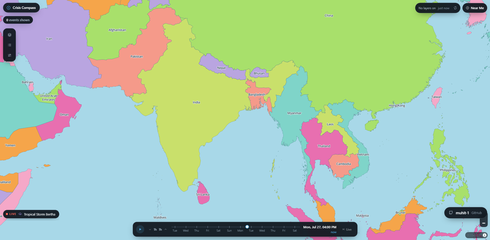
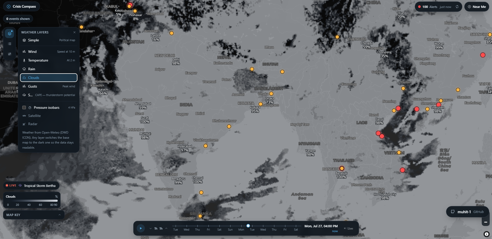
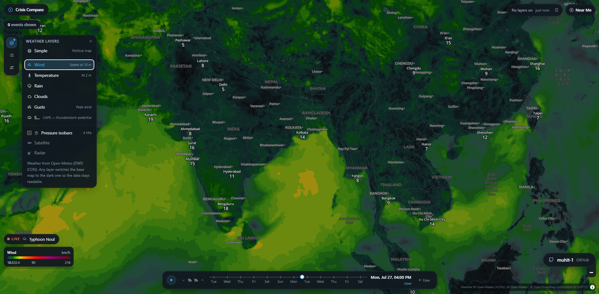
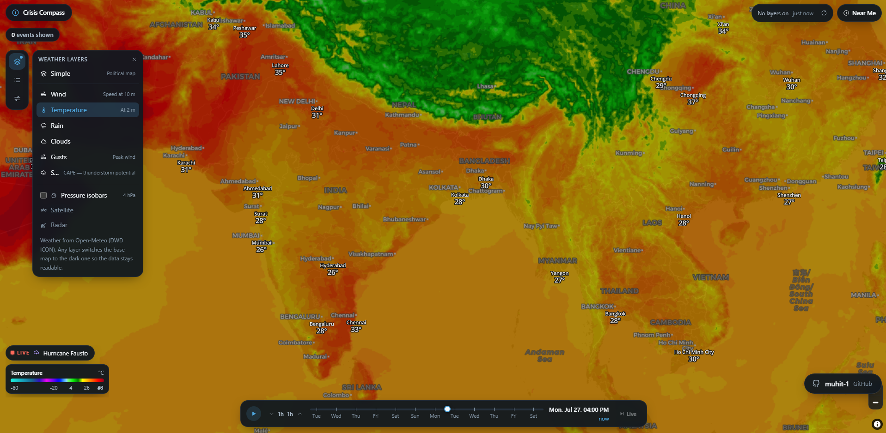

# Crisis Compass

**[Live site: muhit-1.github.io/Crisis-Compass](https://muhit-1.github.io/Crisis-Compass/)**

An interactive world map of live weather and natural disasters. It combines
forecast weather layers with real-time earthquake and disaster-alert feeds, and
lets you scrub backwards and forwards through time to see how conditions
develop.

Everything it uses is free and requires no API key or account.



---

## Contents

- [What it does](#what-it-does)
- [Screenshots](#screenshots)
- [Data sources](#data-sources)
- [Running it](#running-it)
- [How it works](#how-it-works)
- [Project structure](#project-structure)
- [Design decisions](#design-decisions)
- [Known limitations](#known-limitations)
- [Credits](#credits)

---

## What it does

### Weather layers

Six global weather layers, each drawn as a coloured field over the map:

| Layer | What it shows | Source variable |
| --- | --- | --- |
| Wind | Wind speed at 10 m, with direction arrows | `wind_u_component_10m` (+ v) |
| Temperature | Air temperature at 2 m | `temperature_2m` |
| Rain | Precipitation rate | `precipitation` |
| Clouds | Total cloud cover | `cloud_cover` |
| Gusts | Peak wind gusts | `wind_gusts_10m` |
| Storm energy | CAPE, i.e. thunderstorm potential | `cape` |

Mean sea-level pressure isobars can be layered on top of any of them, drawn at
the standard 4 hPa interval with the pressure value labelled along each line.

### A timeline you can scrub

One master clock drives every time-aware layer. It spans roughly seven days of
past weather through to the end of the loaded forecast, at hourly resolution.
There is a play button that animates forward in three-hour steps, and a marker
separating observed past from forecast future.

### Live hazard feeds

- **Earthquakes** from USGS, magnitude 2.5 and above over the past week. Circle
  size and colour encode magnitude. Clicking one opens depth, significance,
  PAGER alert level and a tsunami flag where present.
- **Disaster alerts** from GDACS, the UN and EC joint alerting system, covering
  cyclones, earthquakes, floods, droughts, volcanoes and wildfires. These carry
  official Red, Orange and Green alert levels rather than an estimate.
- **Natural events** from NASA EONET, filterable by category.

### Values on the map

Zoom in and the active weather layer starts labelling values at named cities.
Zoom in further and it switches to labelling every point of the underlying
model grid.

### Point forecasts

Click anywhere on the map to get an hourly forecast for that exact coordinate:
current conditions plus a meteogram showing the temperature curve and hourly
precipitation, with a marker locked to wherever the timeline is.

### Other things

- Four forecast models to choose between, with different resolutions and
  horizons.
- Unit switching for temperature (Celsius, Fahrenheit) and wind (km/h, m/s,
  knots).
- The entire view is encoded in the URL, so a link reproduces exactly what you
  were looking at.
- Keyboard control of the timeline.

---

## Screenshots

**Live hazards over the political base map.** Red and orange circles are GDACS
alerts; the map key in the bottom-left explains what each colour and size means.



**Wind layer with city values and a point forecast.** Selecting any weather
layer switches the base map to the dark one so the data stays legible. City
labels show the value at each named place, and the panel on the right is the
click-anywhere forecast.



**Temperature layer.** Same interaction, different field. The legend in the
bottom-left is generated from the actual colour scale being drawn, so it can
never disagree with the map.



Note: save the four screenshots into `docs/screenshots/` using the filenames
above for these images to appear.

---

## Data sources

Every source below is free, needs no key, and sends
`Access-Control-Allow-Origin: *`, which is what allows the app to call them
directly from the browser with no backend of its own.

| Source | Used for | Notes |
| --- | --- | --- |
| [Open-Meteo spatial tiles](https://github.com/open-meteo/weather-map-layer) | Weather layers, arrows, isobars, grid values | OM-file tiles decoded in the browser |
| [Open-Meteo forecast API](https://open-meteo.com/) | Point forecasts, city values, per-event conditions | Accepts many coordinates in one request |
| [Open-Meteo geocoding](https://open-meteo.com/en/docs/geocoding-api) | Building the city list, at generation time only | Not called at runtime |
| [NASA EONET](https://eonet.gsfc.nasa.gov/) | Natural event catalogue | Wildfires, storms, ice, volcanoes and more |
| [USGS earthquake feeds](https://earthquake.usgs.gov/earthquakes/feed/) | Earthquakes | Pre-generated GeoJSON, updates every minute |
| [GDACS](https://www.gdacs.org/) | Official disaster alert levels | UN OCHA and EC JRC |
| [CARTO basemaps](https://carto.com/basemaps/) | Dark base map | Attribution required |
| [MapLibre demo tiles](https://demotiles.maplibre.org/) | Political base map and country labels | See limitations |

### Forecast models

Four global models are selectable. Each was checked against its own live
`latest.json` to confirm it publishes every variable the app draws. GFS, the UK
Met Office model and JMA were deliberately left out because they omit some of
them, which would have left dead entries in the picker.

| Model | Provider | Horizon |
| --- | --- | --- |
| ICON | DWD | about 5 to 7.5 days depending on run |
| ECMWF IFS | ECMWF | about 15 days |
| ARPEGE | Meteo-France | about 4 days |
| GRAPES | CMA | about 5 days |

The timeline reads its bounds from whichever run is loaded, so switching model
reshapes the scrubber automatically.

---

## Running it

Requires Node 20 or newer. Developed against Node 24.

Install dependencies:

```bash
npm install
```

Start the dev server:

```bash
npm run dev
```

Then open the URL Vite prints, normally `http://localhost:5173`.

Type-check the whole project with `svelte-check` and `tsc`:

```bash
npm run check
```

Produce a static bundle in `dist/`, servable by any static host:

```bash
npm run build
```

Serve the built output locally:

```bash
npm run preview
```

---

## Keyboard shortcuts

| Key | Action |
| --- | --- |
| Space | Play or pause the timeline |
| Left and Right arrows | Step one hour |
| Shift with Left and Right arrows | Step one day |
| N | Jump back to now |
| Escape | Close the open panel |

---

## How it works

### Addressing weather in time

Each Open-Meteo tile file is addressed by two timestamps: which model run
produced it, and which hour that run is describing.

```
<base>/<model>/YYYY/MM/DD/HHMMZ/YYYY-MM-DDTHHMM.om?variable=<name>
                ^^^^^^^^^^^^^^^^ run folder    ^^^^ valid hour
```

The app resolves the current run once at startup and then builds direct file
paths for every subsequent frame. The alternative, going through the provider's
`latest.json` indirection on every request, costs an extra metadata round trip
each time and makes timeline playback unusable.

Two details matter and are handled explicitly:

- **The forecast is not uniformly hourly.** ICON publishes hourly steps out to
  78 hours and three-hourly after that. Scrubbing by raw hours would request
  files that do not exist for two hours out of every three near the end of a
  run, so requested times are snapped to the nearest published step.
- **Past hours come from past runs.** Anything before the current run reads from
  the six-hourly run at or before it, so historical frames are short-lead
  forecasts rather than stale long-range ones.

### Layer stack

The map keeps a fixed drawing order: base map, then weather raster, then
arrows, then isobars, then grid values, then place labels, then hazard markers.
Because overlays are added and removed independently, insertion order alone
cannot guarantee this, so the stack is re-asserted against a single anchor layer
whenever it changes.

### Time scrubbing performance

Moving the timeline swaps the URL on the existing tile source in place rather
than removing and re-adding the layer. Rebuilding per frame would drop each
layer out of its slot in the stack and make playback flicker.

### Severity

Most EONET events have no severity attached, so the app estimates one from
recency, category and live weather, and labels it clearly as an estimate. When a
GDACS alert can be matched to the same incident, that official level is used
instead and the estimate is dropped.

Matching is inferred, because neither feed carries the other's identifiers:

- **Tropical cyclones are matched by name only.** They travel thousands of
  kilometres, so any radius wide enough to catch the right storm also catches
  the wrong one. Both feeds use the WMO storm name, which is unambiguous.
- **Everything else is matched by proximity and overlapping dates**, since those
  hazards are geographically fixed and usually unnamed.

Match rates are naturally low. The two catalogues largely track different
incidents, so on a typical day only a handful of events line up.

---

## Project structure

```
src/
  App.svelte              Layout, panel coordination, URL state, shortcuts
  app.css                 Design tokens and the shared glass panel style
  lib/
    MapView.svelte        The map: all sources, layers and interactions
    TimelineSlider.svelte The scrubber
    FilterSidebar.svelte  Icon rail and its flyout panels
    MapKey.svelte         Legend explaining every marker
    WeatherLegend.svelte  Colour scale for the active layer
    ForecastPanel.svelte  Click-anywhere meteogram
    HazardPanel.svelte    Earthquake and GDACS alert detail
    EventPanel.svelte     EONET event detail
    StatusChips.svelte    Header counts
    LiveBar.svelte        Activity ticker
    NearMeCard.svelte     Local conditions
    Credit.svelte         Author link

    api/
      weather.ts          Open-Meteo point forecasts
      cityValues.ts       Batched city values
      eonet.ts            NASA EONET
      usgs.ts             USGS earthquakes
      gdacs.ts            GDACS alerts

    timelineStore.svelte.ts  Master clock and model selection
    eventsStore.svelte.ts    EONET events
    hazardsStore.svelte.ts   Earthquakes and alerts
    units.svelte.ts          Unit preferences and conversion

    weatherLayers.ts      Layer registry, models, tile URL construction
    basemaps.ts           Base map styles and default view
    severity.ts           Severity estimation and GDACS matching
    urlState.ts           Shareable view state
    data/cities.ts        Generated city list

  types/                  Shared type definitions
```

---

## Design decisions

A few choices here are deliberate and worth explaining, because the obvious
alternative was tried first and did not work.

**The base map is not independently selectable.** Saturated weather rasters over
a pastel political map are unreadable, two bright layers fighting each other.
Selecting any weather layer therefore switches to the dark base map, which the
colour palettes are designed for. The political map is the no-overlay resting
state.

**Event categories start switched off.** An unbounded EONET query returns nearly
seven thousand open events. Rendering all of them on first paint was the single
slowest thing the app did.

**The live feed is capped to 30 days of activity.** The unbounded query returns
about 4.8 MB of JSON, which was being downloaded on load and again on every
refresh. Capping it cuts that to roughly 196 kB. The trade-off is that
long-dormant open events no longer appear; the window is a single constant in
`eventsStore.svelte.ts` if you want them back.

**Values are labelled at cities before grid points.** A named place makes a
number meaningful in a way a bare figure floating over open water does not. The
raw model grid is denser than the screen at low zoom, so it only appears once
zoomed far enough in for the points to separate.

**The weather decoder loads on demand.** The OM-file reader is a roughly 2 MB
WebAssembly module. Registering it up front made every visit pay for it,
including the default view, which has no weather on it at all.

**The opening view is regional, not global.** At world zoom the hazard feeds put
several hundred circles on screen at once, which reads as noise before the
viewer knows what any of them mean.

---

## Known limitations

- **The political base map uses MapLibre's public demo tiles.** They are free
  and keyless but are officially a demo service, and cap out at zoom level 6, so
  they are stretched when zoomed in further. For anything production-grade this
  should be swapped for a self-hosted extract.
- **City coverage is uneven.** The list is 287 major world cities chosen for
  global spread, so dense regions like East Asia show far more labels than
  sparser ones. The list is generated, so extending it means adding names and
  re-running the generator rather than hand-entering coordinates.
- **The past weather window is about seven days.** That is how long the tile
  archive retains previous runs.
- **GDACS returns only Orange and Red alerts by default.** Green alerts are
  filtered out upstream.
- **The main JavaScript bundle is large**, mostly MapLibre. It has not been
  code-split.
- **Radar and satellite layers are listed but not wired up.** They are shown
  disabled rather than hidden so it is clear they are planned rather than
  missing.

---

## Credits

Built by [muhit-1](https://github.com/muhit-1).

Weather data by [Open-Meteo](https://open-meteo.com/). Natural events by
[NASA EONET](https://eonet.gsfc.nasa.gov/). Earthquakes by
[USGS](https://earthquake.usgs.gov/). Disaster alerts by
[GDACS](https://www.gdacs.org/), a joint framework of UN OCHA and the European
Commission. Base maps by [CARTO](https://carto.com/) and
[MapLibre](https://maplibre.org/), built on
[OpenStreetMap](https://www.openstreetmap.org/copyright) data.

Built with [Svelte 5](https://svelte.dev/),
[MapLibre GL JS](https://maplibre.org/), [Tailwind CSS](https://tailwindcss.com/)
and [Vite](https://vite.dev/).
